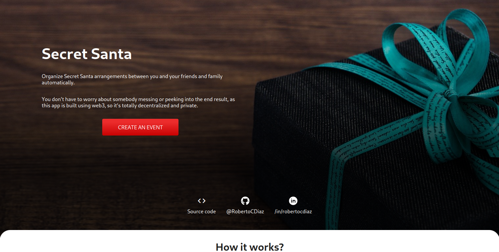

# Secret Santa Organizer



Organize Secret Santa arrangements between you and your friends and family automatically.

You don’t have to worry about somebody messing or peeking into the end result, as this app uses web3 technologies to ensure a complete decentralization of the app's information.

You can find more information on how to deploy your own instance of this application in the next sections.

## Project installation 

1. Clone this repo's source code and cd into it.

```bash
git clone https://github.com/RobertoCDiaz/secret-santa-web3
cd secret-santa-web3
```

2. On both the `hardhat` and `app` directories, install all their npm dependencies. 
```bash
cd hardhat && npm i && cd ..
cd app && npm i && cd ..
```

## Solidity SmartContract configuration and deployment

You can deploy your own instance of the smart contract used for this project to not depend on the official contract's state. 

1. Create an Alchemy node in the Rinkeby network:
    * Sign up to the [Alchemy](https://www.alchemyapi.io) service and create a new app using the Rinkeby network

2. Configure environment variables:
    * Create a `.env` as a copy of the `.env-template` file and replace the values of the following variables.
    * **ALCHEMY_URL** is the URL with the API Key that Alchemy provides on the dashboard for your new app (the one created on the previous step).
    * **PRIVATE_KEY** is the private key for your account on the Rinkeby Network. You can use Metamask to get this.

3. Run the `deploy` npm command to compile and deploy the smart contract

```bash
cd hardhat
npm run deploy
```
The command will create a new contract instance on the Rinkeby's Ethereum Network. This freshly created contract will have an Ethereum Address, which will be printed on your console similarly to
```
Contract Address: 0xa753204f0993037f9C50741FafC4f1A30f3a85B0
```

4. Copy the contract's address and paste it into the [app's constants file](app/constants/index.js) (`/app/constants/index.js`).

```js
//replace the value of CONTRACT_ADDRESS with your contract's address.
export const CONTRACT_ADDRESS = "0xa753204f0993037f9C50741FafC4f1A30f3a85B0";
```

Once you have finished following this steps, you have successfully linked your local application to your own smart contract instance.

## Deploy smart contract on another network

If you want to be able to deploy a new instance of the project's smart contract, you can follow the exact same steps from the previous section, and taking in consideration the following:

* You have to make sure to specify the network that you want the contract to work on when creating your Alchemy application. Also, the private key that you provide in the `.env` file must be from an account of the desired network.

* Currently, the application checks whether you're connected to a wallet on the Rinkeby's testnet or not. You will have to modify the [`app/utils/web3.ts`](app/utils/web3.ts) file to check for the network you will be working on:

```js
// change this 4 for the ID of your network
const NETWORK_ID: number = 4;
```

* You should also change the name of the network inside the `newWeb3ModalInstance()` function, located inside the [`app/utils/web3.ts`](app/utils/web3.ts) file.
```js
export function newWeb3ModalInstance(): Web3Modal {
    return new Web3Modal({
        network: 'rinkeby', // change this value
        providerOptions: {},
        disableInjectedProvider: false,
    });;
}
```

## Start local web application

To start a development server to preview the application on your localhost, go to the `app` directory and run the following command:

```bash
npm run dev
```

This will run a development server for the Next.js app.